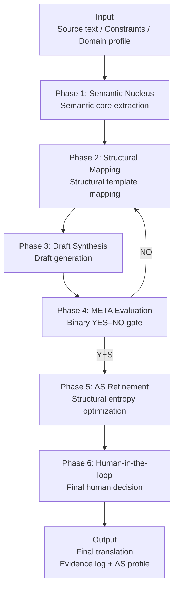

# **📘 Translation OS — Language-Agnostic Core**

A structure-first translation & QA operating system.  
**Version 1.0 · Designed by Hideyuki Okabe**

⭐ If you find Translation OS useful, please consider giving the repository a star!

Translation OS defines a translation pipeline specification, not a model or service.

---

## **🔥 What is Translation OS?**

Translation OS is a reproducible, structure-driven translation operating system that eliminates semantic drift and ensures deterministic, evidence-based translation quality across languages, models, and reviewers.

Unlike conventional translation or LLM prompting, Translation OS is:

* model-agnostic

* language-agnostic

* structure-first

* evidence-based

* reproducible

It treats translation not as *sentence rewriting* but as:

**Meaning → Structure → Evaluation → Refinement**

This is the foundation of a deterministic translation workflow.

---

## **🧠 Core Concepts**

### **Semantic Nucleus Extraction**

Meaning is extracted as minimal, language-agnostic units.

### **Cross-Lingual Structural Mapping**

Structures are normalized before generation.

### **ΔS (Structural Entropy)**

Measures structural drift and instability.

### **META Evaluation (YES/NO Gate)**

Ensures strict structural alignment.

### **Human-in-the-loop Cultural Layer**

Cultural judgment is intentionally **not** automated.

For the full theoretical foundation:  
 👉 [docs/translation_os_core.md](docs/translation_os_core.md)

---

## **🏗 Architecture Overview**

*A deterministic, structure-first translation pipeline with explicit evaluation gates and human oversight.*

### **Architectural Layers (Conceptual)**

The pipeline shown above is implemented on top of the following
conceptual layers:

- **Philosophical Core** — design principles and epistemic constraints  
- **Structural Engine** — language-agnostic structural normalization  
- **Six-Phase Translation Pipeline** — deterministic execution flow  
- **Unified Evaluation Matrix** — explicit QA and decision logic  
- **Counter-Evidence System** — failure detection and rejection paths  
- **Recursive Refinement Engine (ΔS)** — structural stability control  
- **QA Testing Framework** — reproducibility and validation layer

More details:  
👉 [docs/architecture.md](docs/architecture.md)  
👉 [docs/pipeline.md](docs/pipeline.md)  
👉 [docs/overview.md](docs/overview.md)

---

## **🎯 Why Translation OS Matters**

Translation OS addresses critical failure points in MT and LLM-based translation workflows:

- Eliminates semantic drift across models and reviewers  
- Enables reproducible, audit-ready QA  
- Makes evaluation logic explicit and inspectable  
- Supports human-in-the-loop safety by design  
- Decouples translation quality from model behavior

## **🌐 API Endpoints (v1.0)**

Translation OS exposes five minimal REST endpoints:

`POST /v1/semantic-core`  
`POST /v1/structure-remap`  
`POST /v1/synthesize`  
`POST /v1/evaluate`  
`POST /v1/refine`

Full API specification and examples:  
👉 [api/endpoints.md](api/endpoints.md)  
👉 [api/openapi.yml](api/openapi.yml)

---

## **📂 Repository Structure**

`translation-os/`  
`├── README.md`  
`├── LICENSE`  
`├── api/`  
`│   ├── endpoints.md`  
`│   ├── openapi.yml`  
`│   └── examples/`  
`├── docs/`  
`│   ├── overview.md`  
`│   ├── architecture.md`  
`│   ├── pipeline.md`  
`│   └── translation_os_core.md`  
`└── examples/`

---

## **📜 License**

MIT License (recommended for open-source \+ enterprise adoption)

---

## **📩 Contact**

For enterprise use, PoC inquiries, or collaboration:  
LinkedIn → **Hideyuki Okabe**

