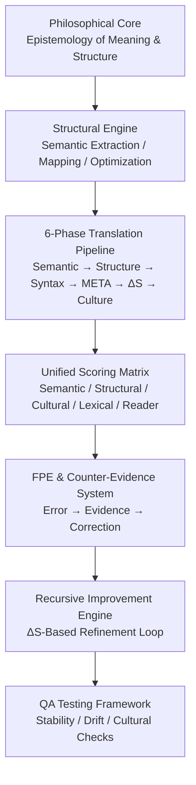
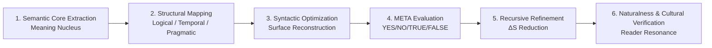
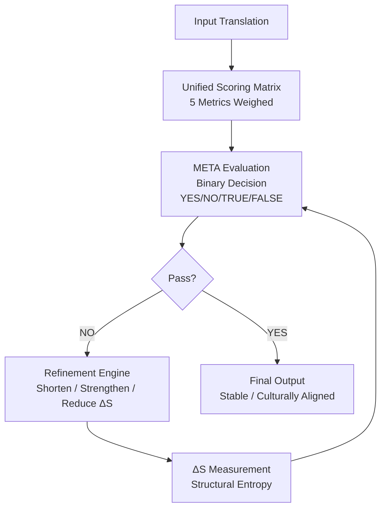

# Overview — Translation OS (Language-Agnostic Core)

TL;DR — Translation OS is a structure-first translation & QA operating system that guarantees reproducibility, semantic fidelity, and deterministic evaluation across languages.

Translation OS is a structure-driven, language-agnostic translation and QA operating system designed to create reproducible, evidence-based, and culturally aligned translations in any domain.

This overview provides a conceptual map of the system:  
its purpose, design philosophy, high-level architecture, and usage.

---

## 🔥 1. Purpose of Translation OS

Modern translation workflows suffer from:

- inconsistency  
- intuition-based decision making  
- unstable MT output  
- lack of structural reasoning  
- limited cultural adequacy  
- no objective evaluation signals  

Translation OS solves this by introducing a unified structural framework that governs how meaning is extracted, mapped, evaluated, and refined.

**Mission:**  
Enable reproducible, structurally consistent, culturally safe, and evaluation-ready translations across languages.

⭐ “Translation OS provides deterministic, explainable translation decisions — independent of model, language, or reviewer.”

---

## 🧠 2. Design Philosophy

Translation OS is built on 7 foundational beliefs:

- Translation is not surface substitution  
- Meaning = structure, not vocabulary  
- Semantic nucleus must be extracted first  
- Context & pragmatics override lexical choices  
- Every correction must include evidence  
- Evaluation must be deterministic (META layer)  
- ΔS (structural entropy) must decrease over time  

In short:

**“Translation = Semantic + Pragmatic + Cultural Structure Mapping”**

---

## 🏗 3. System Architecture (High-Level)

Translation OS contains 7 unified layers:

### **Philosophical Core**  
Defines epistemology of meaning and structure.

### **Structural Engine**  
Performs semantic extraction, mapping, and optimization.

### **6-Phase Translation Pipeline**  
Provides reproducible processing stages.

### **Unified Scoring Matrix**  
Quantifies translation quality (semantic, structural, cultural, lexical).

### **FPE & Counter-Evidence System**  
Error detection with justification.

### **Recursive Improvement Engine**  
ΔS-controlled refinement loop.

### **QA Testing Framework**  
Stress-tests output stability, drift, and cultural alignment.

See `/docs/architecture.md` for details.

---
## ✅ 1. System Architecture Diagram（7-Layer Unified Model）

---

## ✅ **2. 6-Phase Translation Pipeline Diagram**

---

## ✅ **3. Evaluation Flow Diagram（META + ΔS Control）**

## 🔄 4. 6-Phase Translation Pipeline (Summary)

### **Semantic Core Extraction**  
Identify the meaning nucleus.

### **Structural Mapping**  
Align logical, temporal, and pragmatic structure.

### **Syntactic Optimization**  
Rebuild surface form based on structure.

### **META Evaluation**  
Binary judgment (YES/NO/TRUE/FALSE).

### **Recursive Refinement (ΔS-based)**  
Strengthen → shorten → stabilize.

### **Naturalness & Cultural Verification**  
Validate reader resonance and cultural fit.

See `/docs/pipeline.md` for full descriptions.

---

## 📏 5. Evaluation Principles

Translation OS evaluates outputs through:

### **Unified Scoring Matrix**

| Metric              | Weight |
|---------------------|--------|
| Semantic Fidelity   | 0.30   |
| Structural Flow     | 0.20   |
| Lexical Precision   | 0.15   |
| Cultural Adaptation | 0.20   |
| Reader Resonance    | 0.15   |

These weights reflect how Translation OS prioritizes meaning accuracy, structural logic, cultural fit, and user experience.

---

### **META Evaluation Layer**

Binary outputs:

- **YES / NO**
- **TRUE / FALSE**

**Function:**

- Quality gates between phases  
- Stops or continues the pipeline  
- Detects structural or semantic violations  

---

### **Counter-Evidence System**

Each correction must include at least one:

- Structural contradiction  
- Meaning drift  
- Lexical misuse  
- Pragmatic mismatch  
- Cultural unsuitability  

## 🔁 6. Recursive Refinement Engine (ΔS Control)

**Refinement Rules:**

- Shorten & strengthen output  
- Remove redundancy  
- Lower structural entropy (ΔS)  
- Stabilize meaning across iterations  
- Re-run META evaluation until the output converges  

This enables stable, predictable, production-grade translations.

---

## 🌐 7. Integration & API Usage

Translation OS exposes five minimal REST endpoints:

- POST /v1/semantic-core
- POST /v1/structure-remap
- POST /v1/evaluate
- POST /v1/refine
- POST /v1/deltaS

These allow integration into:

- MT pipelines  
- LQA workflows  
- Enterprise QA automation  
- GenAI translation evaluation systems  

See `/api/endpoints.md` for specifics.

---

## 🧩 8. Intended Audience

Translation OS is designed for:

- LSPs (Localization Service Providers)  
- Translation engineers  
- AI/LLM evaluation teams  
- MTPE specialists  
- Enterprise translation teams  
- Researchers working on structure-based translation  

---

## 🚀 9. Why Translation OS Matters

Translation OS achieves what traditional MT or human-only workflows cannot:

- reproducible structural reasoning  
- objective evaluation signals  
- guaranteed reduction of entropy  
- explainable corrections with evidence  
- language-agnostic design (English ⇄ Japanese ⇄ Chinese ⇄ etc.)  
- plug-and-play API suitability  

It represents the next generation of translation frameworks:  
**“Structure-first translation engineering.”**

---

## 📩 Contact

For enterprise collaboration or PoC inquiries:  
LinkedIn: **Hideyuki Okabe**
